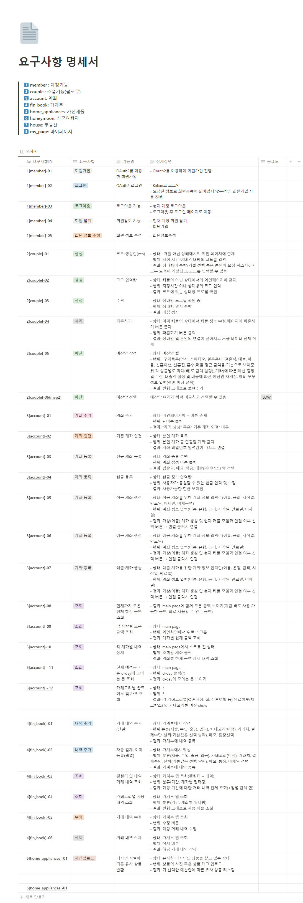
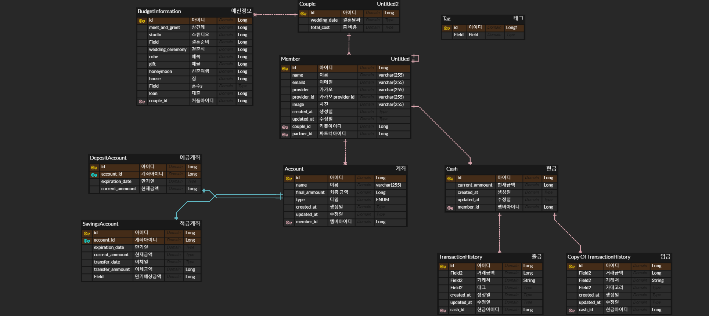

### 2023. 08. 28.

## 요구사항 작성

1. member
    1. 회원가입
    2. 로그인
    3. 로그아웃
2. social
    1. 예비 부부 팔로우(양방향)
    2. 파혼하기 → 양방향 팔로우 취소
3. ⭐ account
    1. 내 계좌 연동
        1. 입출금 통장
        2. 적금 통장(선택)
    2. 총 금액(main page)
        1. 지금 바로 사용할 수 있는 돈(입출금)
        2. 지금 바로 사용할 수 없는 돈(적금)
    3. 결제 카드 연결
        1. 결혼 관련 비용 결제 카드 선택(신용카드)
        2. 자동 정산하기
4. fin_book
    1. 결혼식에 든 비용 가계부 정리하기 + 달력
5. recommend
    1. 예금 선택 및 추천
        1. 신혼 여행지 선택
        2. 가구 및 가전 선택
        3. 부동산 선택(자가, 전세, 월세)
    2. 잔액에 따라 추천해줌
        1. 신혼 여행지
            1. 여행지
            2. 항공편
            3. 예상 금액
        2. 부동산
            1. 지역에 따른 부동산
            2. 신혼부부 관련 정책(링크연결)
            3. 청약 관련
        3. 혼수
            1. 가구
            2. 가전

### 2023. 08. 29.

## 설문조사
| 실제 신혼부부 및 예비부부를 대상으로 구글 폼 설문조사 진행

1. 신혼부부 or 예비부부 선택
2. 결혼 준비를 할 때 가장 힘들었던 점
3. 결혼 준비를 위해 가장 필요하다고 생각하는 3가지
4. 결혼 준비 시 예산 관리를 위해 사용했던 플랫폼
5. 결혼 준비하는 과정(순서), 우선순위
6. 결혼자금을 공동계좌에서 모을 때 신경쓰이는 부분이 있는지

### 2023. 08. 30

## 요구사항 명세서 작성
| 요구사항을 기반으로 세부 기획

### 2023. 08. 31.

## ERD
| 요구사항을 기반으로 ERD 작성 진행중

### 2023. 09. 05.

## API Document
| API Document 작성중

