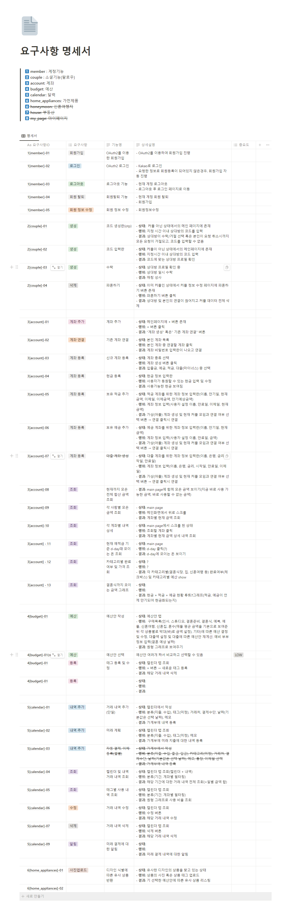

# 프로젝트 기획
실제 신혼부부 및 예비부부를 대상으로 구글 폼 설문조사 진행
1. 신혼부부 or 예비부부 선택
2. 결혼 준비를 할 때 가장 힘들었던 점
3. 결혼 준비를 위해 가장 필요하다고 생각하는 3가지
4. 결혼 준비 시 예산 관리를 위해 사용했던 플랫폼
5. 결혼 준비하는 과정(순서), 우선순위
6. 결혼자금을 공동계좌에서 모을 때 신경쓰이는 부분이 있는지

## 요구사항 작성
1. member
    1. 회원가입
    2. 로그인
    3. 로그아웃
2. social
    1. 예비 부부 팔로우(양방향)
    2. 파혼하기 → 양방향 팔로우 취소
3. ⭐ account
    1. 내 계좌 연동
        1. 입출금 통장
        2. 적금 통장(선택)
    2. 총 금액(main page)
        1. 지금 바로 사용할 수 있는 돈(입출금)
        2. 지금 바로 사용할 수 없는 돈(적금)
    3. 결제 카드 연결
        1. 결혼 관련 비용 결제 카드 선택(신용카드)
        2. 자동 정산하기
4. fin_book
    1. 결혼식에 든 비용 가계부 정리하기 + 달력
5. recommend
    1. 예금 선택 및 추천
        1. 신혼 여행지 선택
        2. 가구 및 가전 선택
        3. 부동산 선택(자가, 전세, 월세)
    2. 잔액에 따라 추천해줌
        1. 신혼 여행지
            1. 여행지
            2. 항공편
            3. 예상 금액
        2. 부동산
            1. 지역에 따른 부동산
            2. 신혼부부 관련 정책(링크연결)
            3. 청약 관련
        3. 혼수
            1. 가구
            2. 가전


## 요구사항 명세서 작성
요구사항 기반으로 세부 기획 및 ERD 작성
### 요구사항명세서

### ERD
 
### API Document


# 추가 기능 구현
## 대출 정보 추천
금융감독원 api로부터 현재 공시 상품 데이터 조회
사용자가 필요한 금액과 수입을 신용 등급을 기준으로 상품 추천
DSR%에 따라 상품 별 대출 한도 제시

## 이미지 유사도 분석을 통한 추천

네이버 쇼핑몰로부터 상품 데이터 조회
이미지 -> 배경제거 -> 이미지 표현한 것을 nparray 형태로 저장
이후 client에 입력 이미지 또한 벡터 표현을 통해 쇼핑몰 데이터와의 L2 거리를 통해 유사도 높은 것부터 반환

# 배포
## 외부 서비스 목록
- 소셜 로그인
    - Kakao Social Login
- AWS
    - AWS EC2
- 금융감독원 공시 대출 조회 api
- 네이버 쇼핑몰 상품 조회 api

## 버전 관리 툴 정보
- git
- gitlab
- webhook

  # 프런트 배포
  ## 빌드 관련 툴 정보
  - Amazon Corretto 11
  - Node.js
      - npm
  - jenkins (Docker)

  ## Install 및 build
  ```bash
  cd frontend
  pwd
  rm -rf build
  npm i
  CI=false npm run build
  ```

  ## 프론트 : Dockerfile, 이미지 빌드, 컨테이너 실행
  ```bash
  FROM node:14 AS build
  WORKDIR /app
  COPY package*.json ./
  COPY build/ ./build
  RUN npm i -g serve
  EXPOSE 3000
  ENTRYPOINT ["serve","-s", "build"]
  ```

  ```bash
  sudo rm -rf /home/ubuntu/dev-front-server/build
  ```

  ```bash
  scp -v -o StrictHostKeyChecking=no -i /var/jenkins_home/J9A307T.pem /var/jenkins_home/workspace/A307_dev_frontend/frontend/package.json ubuntu@j9a307.p.ssafy.io:/home/ubuntu/dev-front-server/package.json
  scp -v -o StrictHostKeyChecking=no -i /var/jenkins_home/J9A307T.pem /var/jenkins_home/workspace/A307_dev_frontend/frontend/package-lock.json ubuntu@j9a307.p.ssafy.io:/home/ubuntu/dev-front-server/package-lock.json
  scp -v -o StrictHostKeyChecking=no -i /var/jenkins_home/J9A307T.pem -r /var/jenkins_home/workspace/A307_dev_frontend/frontend/build ubuntu@j9a307.p.ssafy.io:/home/ubuntu/dev-front-server/build
  ```

  ```bash
  cd dev-front-server
  sudo docker rm -f dev-react-app_application
  sudo docker rmi -f dev-react-app-image
  sudo docker build -t dev-react-app-image .
  sudo docker run --name dev-react-app_application -d -p 3000:3000 dev-react-app-image:latest
  ```

  # 백엔드 배포
  ## 배포 관련 정보
  - Docker 20.10.21
  - 외부 서비스
      - AWS EC2

  ## 백엔드 빌드
  ```bash
  cd /var/jenkins_home/workspace/A307_backend/backend/du-bu
  chmod +x gradlew
  ./gradlew build
  ```

  ## 백엔드 : Dockerfile, 이미지 빌드, 컨테이너 실행
  ```bash
  cp /var/jenkins_home/workspace/setting/application.yml /var/jenkins_home/workspace/A307_backend/backend/du-bu/src/main/resources/application.yml
  ```

  ```bash
  FROM corretto:11
  ARG IDLE_PROFILE
  ARG JAR_FILE=/home/ubuntu/app-server/*.jar
  ENV ENV_IDLE_PROFILE=$IDLE_PROFILE
  COPY ./du-bu-0.0.1-SNAPSHOT.jar app.jar
  RUN echo $ENV_IDLE_PROFILE
  ENTRYPOINT ["java", "-Dspring.profiles.active=${ENV_IDLE_PROFILE}", "-jar","/app.jar"]
  ```

  ```bash
  scp -v -o StrictHostKeyChecking=no -i /var/jenkins_home/J9A307T.pem /var/jenkins_home/workspace/A307_backend/backend/du-bu/build/libs/du-bu-0.0.1-SNAPSHOT.jar ubuntu@j9a307.p.ssafy.io:/home/ubuntu/app-server
  ```

  ```bash
  if sudo docker ps -a | grep dubu-springboot-container; then sudo docker rm -f dubu-springboot-container; fi
  if sudo docker ps -a | grep app-server_application; then sudo docker rmi -f app-server_application:latest; fi
  cd app-server
  sudo docker-compose up -d
  ```

  # nginx 설정

  ```bash
  server {
  	location /{
  		proxy_connect_timeout 90;
  		proxy_send_timeout 90;
  		proxy_read_timeout 90;
  		proxy_pass http://localhost:3000;
  	}
  	location /api {
  		proxy_connect_timeout 90;
  		proxy_send_timeout 90;
  		proxy_read_timeout 90;
  		proxy_pass http://localhost:8080/api;
  	}
  	location /login {
  		proxy_connect_timeout 90;
  		proxy_send_timeout 90;
  		proxy_read_timeout 90;
  		proxy_pass http://localhost:8080/login;
  	}
  	location /oauth2{
  		proxy_connect_timeout 90;
  		proxy_send_timeout 90;
  		proxy_read_timeout 90;
  		proxy_pass http://localhost:8080/oauth2;
  	}
  	listen 443 ssl;
  	ssl_certificate /etc/letsencrypt/live/j9a307.p.ssafy.io/fullchain.pem;
  	ssl_certificate_key /etc/letsencrypt/live/j9a307.p.ssafy.io//privkey.pem;
  }
  server {
  	if ($host = j9a307.p.ssafy.io/) {
  		return 301 https://$host$request_uri;
  	}
  	listen 80;
  	server_name j9a307.p.ssafy.io/;
  	return 404;
  }
  ```

  # 플라스크 배포

  상품 검색 → 배경 제거 → 이미지 벡터 표현은 시간이 오래 걸려 db로 따로 구성하여 데이터 넣어줌 

  대출 관련 정보는 비교적 처리가 빨라 flask 서버 내에서 금융감독원 api를 통해 매달 가져옴

  ## 덤프 데이터 활용 시 배포

  1. 필요 자료 설치
      ```bash
      git clone -b deploy/DA https://lab.ssafy.com/s09-fintech-finance-sub2/S09P22A307.git DA
      cd DA/app/data
      wget --load-cookies ~/cookies.txt "https://docs.google.com/uc?export=download&confirm=$(wget --quiet --save-cookies ~/cookies.txt --keep-session-cookies --no-check-certificate 'https://docs.google.com/uc?export=download&id=1MsE_0gptI8yYtsonnpr8GJw1TBVtBihp' -O- | sed -rn 's/.*confirm=([0-9A-Za-z_]+).*/\1\n/p')&id=1MsE_0gptI8yYtsonnpr8GJw1TBVtBihp" -O data.h5 && rm -rf ~/cookies.txt
      cd ../
      ```
      
  2. 금감원 api 키 입력
      ```bash
      touch .env
      sudo vi .env
      ```
      
      ```bash
      KEY = 금융감독원 api 키
      ```
      
  3. Dockerfile을 통한 docker build    
      ```bash
      docker build -t flask_server .
      ```
      
  4. 빌드 완료 후 해당 이미지 실행
      ```bash
      docker-compose up
      ```
      

  ## 데이터 만들 시 배포
  1. 네이버 쇼핑몰 api 신청([https://developers.naver.com/docs/serviceapi/search/shopping/shopping.md](https://developers.naver.com/docs/serviceapi/search/shopping/shopping.md))
  2. git clone
      ```bash
      git clone -b deploy/DA https://lab.ssafy.com/s09-fintech-finance-sub2/S09P22A307.git DA
      cd DA/shopping_crawler
      ```
      
  3. 필요한 패키지 설치
      ```bash
      pip install -r requirements.txt
      ```
      
  4. 환경변수 생성
      ```bash
      touch .env
      sudo vi .env
      ```
      
  5. 네이버 쇼핑몰 토큰, input query 및 output 경로 입력
      ```bash
      NAVER_ID      = 네이버 아이디
      NAVER_PW      = 네이버 비밀번호
      query_file    = 검색할 입력파일들
      target_file   = db를 출력할 경로({root}/app/data/data.h5 로 설정)
      ```
      
  6. 검색어 설정
      ```json
      {
      		"대분류";
      		{
      				"소분류" : 네이버 쇼핑몰에 검색할 한글이름,
      				...,
      				...,
      		},
          "appliances": 
          {
              "refrigerator": "냉장고",
              "dryer":"건조기",
              "air_cleaner":"공기청정기",
              "rice_cooker":"밥솥",
              "microwave":"전자레인지",
              "air_conditioner":"에어컨",
              "styler":"스타일러",
              "fan":"선풍기",
              "washing_machine":"세탁기",
              "robot_vacuum_cleaner":"로봇청소기",
              "vacuum_cleaner":"청소기",
              "air_fryer":"에어프라이어"
          },
          "furniture" : 
          {
              "sofa":"소파",
              "desk":"책상",
              "drawer":"서랍장",
              "bed":"침대",
              "dressing_table":"화장대",
              "table":"식탁",
              "cabinet":"장식장",
              "wardrobe":"장롱",
              "chair":"의자"
          }
      }
      ```
      
  7. 쇼핑몰 상품 가져오기, 이미지로부터 상품 추출하기
      ```bash
      python json_build.py
      python feature_extract.py
      ```
      
  8. Flask 컨테이너화
      ```bash
      cd ../app
      ```
      
  9. 금감원 api 키 입력
      ```bash
      touch .env
      sudo vi .env
      ```
      
      ```bash
      KEY = 금융감독원 api 키
      ```
      
  10. uwsgi 설정 : port 설정 및 서버 처리 용량에 따른 프로세스 수 설정
      ```bash
      [uwsgi]
      chdir=/www/
      http-socket=:5000
      wsgi-file=/www/app.py
      callable=app
      master=true
      processes=2
      threads=2
      vacuum = true
      disable-logging=True
      ```
      
  11. Flask 서버 빌드
  tensorfow 등등의 패키지가 pip 인덱싱이 되어 있지 않아 pip3로 필요 패키지 추가 
      ```bash
      docker build -t flask_server .
      ```
      
      ```Dockerfile
      FROM python:3
      
      ADD . /www
      WORKDIR /www
      
      RUN python3 -m pip install -U pip
      RUN pip3 install flask
      RUN pip3 install flask-cors
      RUN pip3 install uwsgi
      RUN pip3 install rembg
      RUN pip3 install h5py
      RUN pip3 install tensorflow
      RUN pip3 install Pillow
      RUN pip3 install pandas
      RUN pip3 install numpy
      
      CMD ["uwsgi", "--ini", "uwsgi.ini"]
      ```
      
  12. docker compose로 Flask 서버 실행
      ```bash
      docker-compose up
      ```
      
      ```yml
      version: '3'
      services:
        flask:
          image: flask_server:latest
          container_name: flask
          ports:
           - 5000:5000
          restart: unless-stopped
      ```
